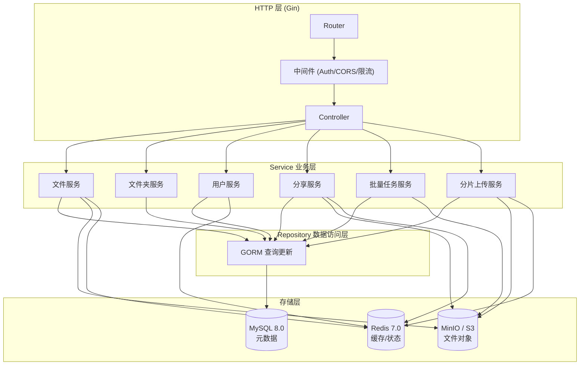

<p align="center">
  <b>GoNetDisk</b>
</p>

<p align="center">
  <b>基于 Go 的轻量级网盘后端服务</b>
</p>

<p align="center">
  
  
  
  
  
  
  
  
</p>

---

GoNetDisk 是一套最小可用的网盘后端，已实现用户体系、JWT 鉴权（含双 Token 刷新）、文件上传下载、分片上传、文件分享、回收站等功能。文件实际存储在 MinIO（S3 兼容对象存储），元数据和目录结构存储在 MySQL，Redis 用于 JWT 黑名单、分享访问计数及分片上传状态。前端为 Vue3 + Vite 构建的单页应用，Go 服务托管构建产物。

## 当前能力

- 用户注册 / 登录（含 IP 频率限制）
- JWT 双 Token 鉴权（Access Token + Refresh Token 无感刷新，禁用用户禁止访问）
- 获取 / 更新当前用户信息、查询存储空间配额
- 单文件上传（MD5 去重、配额检查、文件名冲突处理）
- 分片上传（大文件分片、断点续传、秒传支持）
- 单文件下载（按 `userfile_id`，支持 `Content-Type` 推断和 UTF-8 文件名）
- 文件/目录列表（支持分页、排序）
- 文件重命名、移动
- 文件夹创建、重命名、移动、递归删除/还原
- 物理文件 MD5 去重与引用计数
- 回收站功能（文件/文件夹软删除、列表、还原、永久删除）
- 文件分享（创建分享链接、提取码、过期时间、撤销、访问计数）
- 批量上传任务（创建任务、逐文件上传、进度查询）
- 用户存储配额管理（默认 1GB，已用/总计空间跟踪）
- 完整的 Vue3 前端页面（目录导航、面包屑、上传下载、分享管理、回收站）
- Docker Compose 一键启动完整开发环境（MySQL + Redis + MinIO）

## 架构


```mermaid
graph TD
    subgraph HTTP["HTTP 层 (Gin)"]
        Router --> Middleware["中间件 (Auth/CORS/限流)"] --> Controller
    end

    subgraph Service["Service 业务层"]
        FileService["文件服务"]
        FolderService["文件夹服务"]
        UserService["用户服务"]
        ShareService["分享服务"]
        TaskService["批量任务服务"]
        ChunkService["分片上传服务"]
    end

    subgraph Repo["Repository 数据访问层"]
        GORM["GORM 查询更新"]
    end

    subgraph Storage["存储层"]
        MySQL[("MySQL 8.0<br/>元数据")]
        Redis[("Redis 7.0<br/>缓存/状态")]
        MinIO[("MinIO / S3<br/>文件对象")]
    end

    Controller --> FileService
    Controller --> FolderService
    Controller --> UserService
    Controller --> ShareService
    Controller --> TaskService
    Controller --> ChunkService

    FileService --> GORM
    FolderService --> GORM
    UserService --> GORM
    ShareService --> GORM
    TaskService --> GORM
    ChunkService --> GORM

    GORM --> MySQL
    FileService --> MinIO
    ShareService --> MinIO
    TaskService --> MinIO
    ChunkService --> MinIO

    UserService --> Redis
    ShareService --> Redis
    ChunkService --> Redis
    FileService --> Redis
```

## 项目结构

```text
GoNetDisk/
├── cmd/server/              # 服务入口
├── configs/                 # 配置结构和 YAML
│   ├── config.go            # 配置结构体定义 + Viper 加载器
│   ├── config.yaml           # 本地开发配置
│   └── config.release.yaml  # Docker 部署配置
├── internal/
│   ├── controller/          # HTTP 控制器（含分片上传控制器）
│   ├── api/                 # 请求/响应 DTO（含 binding 标签）
│   ├── middleware/          # Auth / CORS / IP 限流 中间件
│   ├── model/               # GORM 数据模型（7 张表）
│   ├── repository/          # 数据访问层（含分片仓储）
│   ├── router/              # 路由装配（依赖注入 + SPA fallback）
│   ├── service/             # 业务逻辑层（含分片上传服务）
│   └── util/                # JWT / 校验 / 文件名处理 / 分片工具
├── pkg/
│   ├── database/            # MySQL + Redis 初始化 + AutoMigrate
│   └── storage/             # MinIO 客户端初始化
├── front/                   # Vue3 + Vite 前端
│   ├── index.html           # Vite 入口 HTML
│   ├── vite.config.js       # Vite 配置（dev server 代理 / 构建输出）
│   ├── package.json
│   └── src/
│       ├── main.js          # Vue 应用入口
│       ├── App.vue          # 根组件（布局框架 + 全局弹窗）
│       ├── style.css        # 全局样式（CSS 变量 / 响应式）
│       ├── api/index.js     # API 客户端封装（含 Token 刷新拦截器）
│       ├── router/index.js  # 路由配置（含导航守卫）
│       ├── components/      # 可复用组件（Modal / Toast / ContextMenu）
│       ├── utils/           # 工具函数（格式化 / 文件类型判断）
│       └── views/           # 视图页面
│           ├── LoginView.vue
│           ├── RegisterView.vue
│           ├── FilesView.vue
│           ├── TrashView.vue
│           ├── SharesView.vue
│           ├── ShareDownloadView.vue
│           └── SettingsView.vue
├── docker/                  # Docker 开发环境
│   ├── docker-compose.yaml  # MySQL 8.0 + Redis 7.0 + MinIO
│   └── init/init.sql        # 初始表结构
└── ai-docs/                 # AI 协作文档
```

## 技术栈

| 类别 | 技术 |
|------|------|
| 语言 | Go 1.25+ |
| Web 框架 | Gin 1.12.0 |
| ORM | GORM 1.31.1 |
| 数据库 | MySQL 8.0 |
| 缓存 | Redis 7.0 (go-redis v9) |
| 对象存储 | MinIO (minio-go v7) |
| 配置 | Viper 1.21.0 |
| 认证 | golang-jwt/jwt/v5 5.3.1 |
| 密码哈希 | golang.org/x/crypto bcrypt |
| 限流 | golang.org/x/time/rate |
| 前端框架 | Vue 3.5 + Vue Router 4.x |
| 构建工具 | Vite 6.x |
| 前端依赖 | spark-md5（文件哈希计算） |

## 快速开始

### 环境要求

- Go 1.25+
- Node.js 18+（前端开发）
- Docker（用于启动 MySQL + Redis + MinIO）

### 1. 启动基础设施

```bash
cd docker
docker-compose up -d
```

这将启动三个容器：
- **MySQL 8.0** — 端口 `3306`，自动创建 `gonetdisk` 数据库并执行初始化 SQL
- **Redis 7.0** — 端口 `6379`，用于 Token 黑名单、分享计数、分片状态
- **MinIO** — API 端口 `9000`，控制台端口 `9001`，自动创建 `gonetdisk` bucket

仅启动基础设施（不启动 Go 服务）：

```bash
docker-compose up -d mysql redis minio
```

### 2. 检查配置

编辑 `configs/config.yaml`：

```yaml
server:
  port: 9090
  host: "0.0.0.0"
  mode: debug

redis:
  host: "localhost"
  port: 6379
  password: ""
  db: 0

minio:
  endpoint: "localhost:9000"
  accesskey: "gonetdisk"
  secretkey: "gonetdisk"
  bucket: "gonetdisk"
  usessl: false

database:
  host: "localhost"
  port: 3306
  user: "root"
  password: "gonetdisk"
  name: "gonetdisk"
  charset: "utf8mb4"
  parseTime: true
  loc: "Local"

jwt:
  secret: "your-secret-key"
  accessexpiresmin: 1440
  refreshexpireshour: 168

upload:
  maxFileSizeMB: 100
```

配置加载采用三级策略：`CONFIG_PATH` 环境变量 → 可执行文件同级 `configs/config.yaml` → 当前工作目录 `configs/config.yaml`。

### 3. 启动后端服务

```bash
go run cmd/server/main.go
```

默认监听地址：`http://localhost:9090`

启动时会打印配置文件路径、Redis 连接状态、MinIO 端点与 Bucket、运行模式和监听地址。

### 4. 前端开发与构建

**开发模式**（Vite dev server，支持 HMR 热更新）：

```bash
cd front
npm install
npm run dev
```

前端开发服务器运行在 `http://localhost:5173`，API 请求自动代理到后端 `http://localhost:9090`。

**生产构建**（Go 服务托管静态文件）：

```bash
cd front
npm run build
```

构建产物输出到 `front/dist/`，Go 服务启动后浏览器直接访问 `http://localhost:9090` 即可。

### 5. 编译基线校验

```powershell
$env:GOCACHE = (Join-Path $PWD '.gocache')
go build ./...
```

## API

基础前缀：`/api/v1`

端口占用关系：后端 `9090` | MySQL `3306` | Redis `6379` | MinIO `9000`（控制台 `9001`）| 前端 dev `5173`。

### 用户模块

| 方法 | 路径 | 说明 | 认证 |
|------|------|------|:----:|
| POST | `/user/register` | 注册（限流：5次/25分钟） | 否 |
| POST | `/user/login` | 登录（限流：5次/25分钟） | 否 |
| POST | `/user/refresh` | 刷新 Access Token（限流：5次/5分钟） | 否 |
| GET | `/user/info` | 获取当前用户信息 | 是 |
| PUT | `/user/info` | 更新当前用户信息 | 是 |
| GET | `/user/space` | 查询存储空间（已用/总计） | 是 |

鉴权使用双 Token 机制：登录返回 Access Token（默认 24h）和 Refresh Token（默认 7d），前端自动在 Access Token 过期时调用 `/user/refresh` 无感续期。

### 文件模块

| 方法 | 路径 | 说明 | 认证 |
|------|------|------|:----:|
| POST | `/file/upload` | 上传文件 | 是 |
| GET | `/file/download/:userfile_id` | 下载文件 | 是 |
| GET | `/file/list` | 获取文件列表 | 是 |
| PUT | `/file/rename` | 重命名文件 | 是 |
| PUT | `/file/move` | 移动文件 | 是 |
| DELETE | `/file/delete/:userfile_id` | 移入回收站 | 是 |
| DELETE | `/file/remove/:userfile_id` | 永久删除 | 是 |

上传接口使用 `multipart/form-data`：

- `file`: 必填，上传文件
- `parent_id`: 选填，父目录 ID，根目录传 `0`

上传响应返回 `userfile_id`、`file_name`、`file_ext`、`file_size`、`parent_id`，不返回下载 URL。下载需通过 `GET /file/download/:userfile_id` 单独调用。

文件列表接口支持以下参数：

- `parent_id`: 父目录 ID，根目录传 `0`
- `page`: 页码，默认 1
- `page_size`: 每页数量，默认 5，最大 100
- `sort_by`: 排序字段，可选 `file_name`、`file_size`、`created_at`、`updated_at`，默认 `updated_at`
- `order_by`: 排序方向，可选 `asc`、`desc`，默认 `desc`

### 分片上传模块

用于上传大文件（>100MB），支持断点续传和秒传（通过完整文件 MD5 快速完成）。

| 方法 | 路径 | 说明 | 认证 |
|------|------|------|:----:|
| POST | `/file/chunk/init` | 初始化分片上传任务 | 是 |
| POST | `/file/chunk/upload` | 上传单个分片 | 是 |
| POST | `/file/chunk/complete` | 合并分片完成上传 | 是 |
| GET | `/file/chunk/status` | 查询上传进度 | 是 |

请求体示例（初始化）：

```json
{
  "file_name": "video.mp4",
  "file_size": 1073741824,
  "file_ext": ".mp4",
  "chunk_size": 5242880,
  "total_chunks": 205,
  "file_md5": "d41d8cd98f00b204e9800998ecf8427e",
  "parent_id": 0
}
```

### 文件夹模块

| 方法 | 路径 | 说明 | 认证 |
|------|------|------|:----:|
| POST | `/folder/create` | 创建文件夹 | 是 |
| PUT | `/folder/rename` | 重命名文件夹 | 是 |
| PUT | `/folder/move` | 移动文件夹 | 是 |
| DELETE | `/folder/delete/:userfolder_id` | 移入回收站 | 是 |
| DELETE | `/folder/remove/:userfolder_id` | 永久删除 | 是 |

创建文件夹请求支持 JSON 或表单：

- `folder_name`: 必填，文件夹名
- `parent_id`: 选填，父目录 ID，根目录传 `0`

创建成功后返回新文件夹的 `folder_id`。

### 回收站模块

| 方法 | 路径 | 说明 | 认证 |
|------|------|------|:----:|
| GET | `/trash/list` | 获取回收站列表 | 是 |
| POST | `/trash/file/:userfile_id` | 还原文件 | 是 |
| POST | `/trash/folder/:userfolder_id` | 还原文件夹 | 是 |

回收站列表接口支持以下参数：

- `page`: 页码，默认 1
- `page_size`: 每页数量，默认 5，最大 100

### 分享模块

| 方法 | 路径 | 说明 | 认证 |
|------|------|------|:----:|
| POST | `/share/create` | 创建分享链接 | 是 |
| GET | `/share/list` | 获取我的分享列表 | 是 |
| GET | `/share/:share_code/info` | 获取分享信息 | 否 |
| GET | `/share/:share_code/download` | 下载分享文件 | 否 |
| DELETE | `/share/:share_code` | 撤销分享 | 是 |

创建分享时支持可选的提取码和过期时间。分享链接格式：

```
<origin>/#/share?code=<UUID>&pwd=<提取码>
```

公开端点 `/info` 和 `/download` 均通过 query 参数 `?code=` 校验提取码。

### 批量上传任务模块

| 方法 | 路径 | 说明 | 认证 |
|------|------|------|:----:|
| POST | `/task/create` | 创建批量上传任务 | 是 |
| POST | `/task/:task_id/file` | 上传任务中的文件 | 是 |
| GET | `/task/:task_id/progress` | 查询任务进度 | 是 |

## 前端功能

前端为 Vue 3 + Vite 构建的单页应用，Go 服务托管 `front/dist/` 构建产物。主要功能：

- 用户注册 / 登录（含 Token 自动刷新）
- 用户设置（查看与修改个人信息、存储空间用量）
- 目录导航（面包屑 + 表格列表）
- 创建文件夹
- 上传文件（小文件直接上传，大文件自动分片上传）
- 下载文件
- 重命名文件/文件夹
- 移动文件/文件夹
- 移入回收站 / 永久删除 / 批量操作
- 文件分享（创建链接、提取码、复制链接含密码、撤销）
- 分享链接公开访问页面（提取码验证、一键下载）
- 回收站查看、还原
- 存储空间使用量显示
- 侧边栏导航（全部文件 / 我的分享 / 回收站 / 设置）

## 请求示例

### 注册

```bash
curl -X POST http://localhost:9090/api/v1/user/register \
  -H "Content-Type: application/json" \
  -d '{"username":"test","email":"test@example.com","password":"123456"}'
```

### 登录

```bash
curl -X POST http://localhost:9090/api/v1/user/login \
  -H "Content-Type: application/json" \
  -d '{"email":"test@example.com","password":"123456"}'
```

### 上传文件

```bash
curl -X POST http://localhost:9090/api/v1/file/upload \
  -H "Authorization: Bearer <your-token>" \
  -F "parent_id=0" \
  -F "file=@/path/to/photo.jpg"
```

### 分片上传（初始化）

```bash
curl -X POST http://localhost:9090/api/v1/file/chunk/init \
  -H "Authorization: Bearer <your-token>" \
  -H "Content-Type: application/json" \
  -d '{"file_name":"video.mp4","file_size":1073741824,"file_ext":".mp4","chunk_size":5242880,"total_chunks":205,"file_md5":"d41d8cd...","parent_id":0}'
```

### 下载文件

```bash
curl -O -J http://localhost:9090/api/v1/file/download/<userfile_id> \
  -H "Authorization: Bearer <your-token>"
```

### 获取文件列表

```bash
curl -X GET "http://localhost:9090/api/v1/file/list?parent_id=0&page=1&page_size=20" \
  -H "Authorization: Bearer <your-token>"
```

### 创建文件夹

```bash
curl -X POST http://localhost:9090/api/v1/folder/create \
  -H "Authorization: Bearer <your-token>" \
  -H "Content-Type: application/json" \
  -d '{"folder_name":"docs","parent_id":0}'
```

### 重命名文件

```bash
curl -X PUT http://localhost:9090/api/v1/file/rename \
  -H "Authorization: Bearer <your-token>" \
  -H "Content-Type: application/json" \
  -d '{"userfile_id":1,"new_name":"new_name.txt"}'
```

### 移动文件

```bash
curl -X PUT http://localhost:9090/api/v1/file/move \
  -H "Authorization: Bearer <your-token>" \
  -H "Content-Type: application/json" \
  -d '{"userfile_id":1,"target_parent_id":5}'
```

### 移入回收站

```bash
curl -X DELETE http://localhost:9090/api/v1/file/delete/1 \
  -H "Authorization: Bearer <your-token>"
```

### 永久删除

```bash
curl -X DELETE http://localhost:9090/api/v1/file/remove/1 \
  -H "Authorization: Bearer <your-token>"
```

### 创建分享链接

```bash
curl -X POST http://localhost:9090/api/v1/share/create \
  -H "Authorization: Bearer <your-token>" \
  -H "Content-Type: application/json" \
  -d '{"user_file_id":1,"code":"1234","expire_days":7}'
```

### 获取分享信息

```bash
curl -X GET "http://localhost:9090/api/v1/share/<share_code>/info?code=1234"
```

### 下载分享文件

```bash
curl -O -J "http://localhost:9090/api/v1/share/<share_code>/download?code=1234"
```

### 批量上传任务

```bash
# 创建批量任务
curl -X POST http://localhost:9090/api/v1/task/create \
  -H "Authorization: Bearer <your-token>" \
  -H "Content-Type: application/json" \
  -d '{"parent_id":0,"files":[{"file_name":"a.txt","file_size":1024,"file_ext":".txt"}]}'

# 上传任务中的文件
curl -X POST http://localhost:9090/api/v1/task/<task_id>/file \
  -H "Authorization: Bearer <your-token>" \
  -F "file_record_id=1" \
  -F "file=@/path/to/a.txt"
```

## 数据设计

当前 Go 代码通过 AutoMigrate 维护七张核心表：

| 表名 | 用途 |
|------|------|
| `user` | 用户账户、密码哈希、存储配额（默认 1GB） |
| `physical_file` | 物理文件元数据：MD5 哈希、MinIO 存储路径、引用计数 |
| `user_file` | 用户逻辑文件系统：父子目录层级、path_stack、软删除标记 |
| `upload_task` | 批量上传任务：状态、文件计数、总大小 |
| `upload_file_record` | 批量任务中的单个文件记录 |
| `chunk_upload` | 分片上传任务：上传 ID、分片大小、总分片数、已上传分片位图、文件 MD5 |
| `share` | 分享链接：UUID 分享码、提取码、过期时间、浏览次数 |

设计要点：

- `physical_file` 负责任一物理文件的元数据和去重；同一内容只存一份，通过 `file_hash` 复用
- `user_file` 负责每个用户的目录视图和文件关系；通过 `physical_id` 外键关联物理文件
- 删除文件时不会立即删除物理文件，而是递减引用计数；引用计数归零才从 MinIO 中删除
- 当前摘要算法为 MD5
- 文件夹层级通过 `path_stack` 字段（如 `/0/1/5`）实现高效的祖先路径查询
- 分片上传通过 Redis 记录已上传分片集合，支持断点续传；完整文件 MD5 匹配时走秒传路径
- 分享访问计数使用 Redis 计数器，每分钟同步回 MySQL

Redis 数据用途：

| Key 模式 | 用途 |
|----------|------|
| `blacklist:access:<jti>` | Access Token 黑名单（注销/刷新后失效） |
| `blacklist:refresh:<jti>` | Refresh Token 黑名单 |
| `share:view:<share_code>` | 分享链接访问计数（定时同步 MySQL） |
| 分片上传相关 Key | 分片上传进度与状态管理 |

`docker/init/init.sql` 中额外定义了 `role`、`admin`、`permission`、`role_permission` 表草案，用于未来的 RBAC 权限系统，当前无对应 Go 实现。

## 当前可优化问题

### Bug

- `GetSpace`（`internal/repository/file_repo.go:278`）查询条件使用 `user_id` 字段，但 `User` 模型主键为 `id`，且该方法当前未被调用，应删除或修正
- 注册缺少密码强度校验（已内置 `util.ValidatePassword`，需接入到 `Register` 流程）
- `SoftDeleteUserItem` 返回裸 `errors.New()`，调用方无法使用 `errors.Is` 判断错误类型

### 代码质量

- `GetUserInfo`（根据 email 查询）与 `UpdateUserInfo`（根据 userID 查询）身份标识不一致，建议统一使用 userID
- 物理文件引用计数操作（`IncrPhyFileRefCount` / `DecrPhyFileRefCount`）未使用数据库事务，在高并发场景可能存在竞态
- 用户 `status` 字段使用裸 `int`（0/1），缺少命名常量
- 存在 `jwtManger` 拼写错误（应为 `jwtManager`）

### 缺失

- 仓库无自动化测试（0 个 `_test.go` 文件）
- 上传缺少 MIME 白名单和内容级文件类型校验
- 缺少文件预览功能

## 开发路线

- [x] 用户注册 / 登录
- [x] JWT 鉴权
- [x] 双 Token 刷新机制
- [x] 用户状态校验（`user.status` 接入登录与鉴权）
- [x] 统一用户错误模型（400/401/403/404/409/500）
- [x] 文件上传（MD5 去重 + 引用计数）
- [x] 分片上传（断点续传 + 秒传）
- [x] Redis 集成（Token 黑名单 / 分享计数 / 分片状态）
- [x] 文件下载
- [x] 文件列表
- [x] 文件夹创建 / 重命名 / 移动
- [x] 文件重命名 / 移动
- [x] 回收站（软删除、还原、永久删除）
- [x] 文件分享（提取码 + 过期时间 + 访问计数）
- [x] 批量上传任务（进度跟踪）
- [x] IP 频率限制
- [x] 配置加载收口（三级策略）
- [x] 前端 Vue3 + Vite 重构
- [x] 前端完整 UI 实现（文件浏览 / 分享管理 / 回收站 / 设置）
- [ ] 自动化测试
- [ ] 密码强度校验接入注册流程
- [ ] 文件预览
- [ ] 管理后台（RBAC）

## License

MIT

---

*最后更新：2026-05-28*
